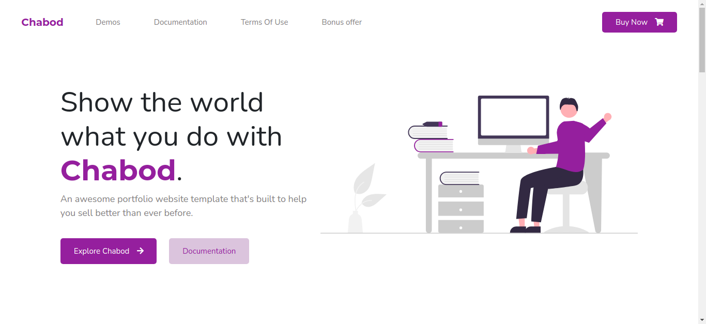

# Chabod-7.0

## Project site

This project is hosted live on netlify. Click on this link below to see it live -
https://getchabod.netlify.app

## About Chabod 7.0

> Getchabod is the landing page of the chabod theme (Chabod 7.0).
> It has a simple but very neat design - a cool UI.

> It's the launch site for Chabod. It contains the documentation and other important details about Chabod 7.0.

## Project Stack/Build Tools

1. HTML5
2. CSS3
3. SASS
4. Gulp.Js
5. Bootstrap 5

### Chabod landing banner

